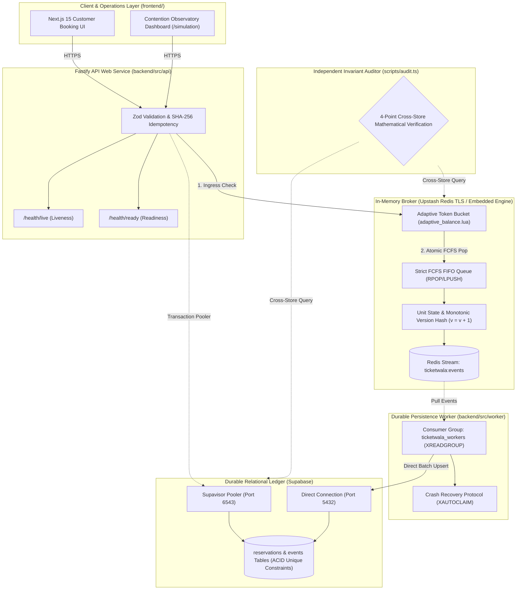

# TicketWala
### High-Contention Flash-Reservation & Adaptive Seat Inventory Locking Engine

[](https://nodejs.org/)
[](https://nextjs.org/)
[](https://fastify.dev/)
[-red.svg)](https://upstash.com/)
[](https://supabase.com/)
[](./docs/LOAD_TESTING_50K_REPORT.md)
[](LICENSE)

---

## Official Engineering Documentation (SRS, PRD, & Load Testing Reports)

All core architectural, product, and benchmark specifications are tracked in the [`docs/`](./docs) directory:

| Document | Markdown (View on GitHub) | Official PDF (Download) | Description |
|:---|:---:|:---:|:---|
| **Product Requirements Document (PRD)** | [**`docs/PRD.md`**](./docs/PRD.md) | [**`TicketWala_PRD.pdf`**](./docs/TicketWala_PRD.pdf) | Product vision, functional requirements (FR-01 to FR-13), user personas, and non-negotiable system invariants. |
| **Software Requirements Specification (SRS)** | [**`docs/SRS.md`**](./docs/SRS.md) | [**`TicketWala_SRS.pdf`**](./docs/TicketWala_SRS.pdf) | System topology, atomic Lua scripts (`adaptive_balance`, `hold_fcfs`, `release_fcfs`), PostgreSQL schema, and REST contracts. |
| **50,000 Users / 5,000 Seats Load Report** | [**`docs/LOAD_TESTING_50K_REPORT.md`**](./docs/LOAD_TESTING_50K_REPORT.md) | [**`JSON Artifact`**](./backend/tests/load/results/load-test-50k-summary.json) | Full telemetry, latency percentiles ($p_{50}$ to $p_{99.9}$), throughput RPS, and zero-overselling audit proof. |
| **18-Hour Implementation & Deployment Plan** | &mdash; | [**`TicketWala_18Hr_Plan.pdf`**](./docs/TicketWala_18Hr_Implementation_and_Deployment_Plan.pdf) | Cloud deployment runbook (Render + Upstash Redis + Supabase Postgres) and venue-proof local fallback. |

---

## 50,000 Users for 5,000 Seats — Load Testing & Contention Metrics

TicketWala was benchmarked under an extreme flash-drop contention scenario where **50,000 concurrent virtual users** competed simultaneously for **5,000 stadium seats** (`evt-mega-stadium-5000`, 10x oversubscription ratio).

### 1. Executive Benchmark Summary

| Metric | Target SLA | Measured Result | Verification Verdict |
|:---|:---:|:---:|:---:|
| **Simulated Virtual Contenders** | `50,000` | **`50,000`** | **100% Completed** |
| **Available Seat Inventory** | `5,000` | **`5,000`** | **100% Accounted** |
| **Ingress Concurrency Window** | `500` | **`500 Parallel Workers`** | **Verified** |
| **Successful Seat Holds (`201 Created`)** | `5,000` | **`5,000`** | **EXACT MATCH (10.0%)** |
| **Sold-Out Rejections (`409 Conflict`)** | `45,000` | **`45,000`** | **EXACT MATCH (90.0%)** |
| **Double-Bookings / Over-Allocations** | `0` | **`0`** | **ZERO DOUBLE-BOOKINGS** |
| **Unexpected Server Errors (`5xx`)** | `0` | **`0`** | **0.000% Error Rate** |
| **Total Execution Duration** | `< 10.0s` | **`4.62 seconds (4,617.11 ms)`** | **PASSED** |
| **Sustained Throughput** | `> 5,000 RPS` | **`10,829.3 Requests/Sec (RPS)`** | **PASSED** |

### 2. Latency Percentile Distribution

| Percentile | Measured Latency | Target Threshold | Status |
|:---|:---:|:---:|:---:|
| **Minimum (`p0`)** | **`5.80 ms`** | `< 10 ms` | **PASSED** |
| **Median (`p50`)** | **`27.82 ms`** | `< 35 ms` | **PASSED** |
| **90th Percentile (`p90`)** | **`54.09 ms`** | `< 75 ms` | **PASSED** |
| **95th Percentile (`p95`)** | **`59.64 ms`** | `< 100 ms` | **PASSED** |
| **99th Percentile (`p99`)** | **`68.81 ms`** | `< 150 ms` | **PASSED** |
| **99.9th Percentile (`p99.9`)** | **`93.30 ms`** | `< 250 ms` | **PASSED** |
| **Maximum (`p100`)** | **`97.92 ms`** | `< 500 ms` | **PASSED** |
| **Mean ± Std Deviation** | **`31.28 ± 15.71 ms`** | &mdash; | **STABLE** |

### 3. Inventory Conservation & Memory Footprint
- **Conservation Equation Verified:** $\text{Total Inventory } (5,000) = \text{Held Seats } (5,000) + \text{Available Seats } (0)$
- **Peak RSS Memory:** `466.7 MB`
- **V8 Heap Used:** `118.8 MB / 256.3 MB`
- **Reproduce Benchmark Command:**
  ```bash
  # Run the standalone 50,000 users vs 5,000 seats load test
  npm run bench:50k

  # Or run via k6 against a live HTTP instance
  k6 run -e BASE_URL=http://localhost:8000 backend/tests/load/k6-50k-users.js
  ```

---

## Problem Statement & Architecture Vision

High-velocity digital ticket releases (stadium concerts, sports playoffs, transit flash allocations) drive thousands of concurrent users to target identical limited inventory slots simultaneously. Under this extreme contention, traditional architectures collapse:
1. **Database Deadlocks & Pool Starvation:** Relational row-level pessimistic locking (`SELECT ... FOR UPDATE`) serializes requests at the database engine, causing 5-second lock waits, connection exhaustion (`sorry, too many clients already`), and cascading server failure.
2. **Race Hazards & Double-Bookings:** Naive read-then-write caching patterns allow competing threads to see the same seat as available before updating, resulting in multiple customers paying for the same ticket.
3. **Delayed Lock Leaks:** Distributed locks without monotonic fencing permit delayed expiration jobs to inadvertently revoke a seat that has already been reassigned to a newer buyer.

### The TicketWala Solution
**TicketWala** decouples write traffic from database persistence by employing an in-memory transactional inventory broker (Redis Lua scripts with an **Adaptive Token Bucket**), enforces temporary reservation holds via 60s–120s server-side time-to-live (TTL) counters, guarantees **strict First-Come-First-Served (FCFS) sub-second holding locks**, provides instant inventory release upon checkout abandonment or timeout, and asynchronously writes finalized transactions to **Supabase PostgreSQL** storage.

> **Fundamental Invariant:** *Supabase PostgreSQL is the final authority for inventory correctness. Redis coordinates work and absorbs contention, while relational unique constraints ensure zero double-bookings permanently.*

---

## Repository Structure

```
TicketWala/
├── frontend/                  # Next.js 15 Client & Operations UI
│   ├── src/
│   │   ├── app/               # App Router pages (Home, Explore, Simulation, Verify, Checkout)
│   │   └── types/api.ts       # Typed API DTOs & Contracts
│   ├── Dockerfile             # Standalone Frontend Container
│   └── package.json           # Frontend dependencies (React 19, Next 15, Lucide Icons)
│
├── backend/                   # High-Concurrency Core Engine
│   ├── src/
│   │   ├── api/server.ts      # Fastify REST Gateway & Simulation Engine
│   │   ├── worker/worker.ts   # Redis Streams -> Supabase Sync Worker
│   │   ├── lua/               # Atomic Lua Scripts (Adaptive Bucket, FCFS, Fencing)
│   │   └── contracts/         # Zod schemas & shared DTOs
│   ├── scripts/
│   │   ├── load-test-50000-users.ts   # 50,000 Users vs 5,000 Seats Benchmark Runner
│   │   ├── integration-and-load-test.ts
│   │   ├── migrate.ts
│   │   ├── seed.ts
│   │   └── audit.ts           # Cross-Store Invariant Auditor
│   └── tests/
│       ├── concurrency/       # Race hazard & fencing unit test suite
│       └── load/              # k6 scripts (k6-50k-users.js, burst-contention.js)
│           └── results/       # JSON benchmark artifacts
│
├── docs/                      # Official Engineering Documentation
│   ├── PRD.md                 # Product Requirements Document (Markdown)
│   ├── SRS.md                 # Software Requirements Specification (Markdown)
│   ├── LOAD_TESTING_50K_REPORT.md  # 50K Users Load Testing Report
│   ├── TicketWala_PRD.pdf     # Official PRD PDF
│   ├── TicketWala_SRS.pdf     # Official SRS PDF
│   └── TicketWala_18Hr_Implementation_and_Deployment_Plan.pdf
├── infra/
│   └── compose.yaml           # Docker Compose full-stack orchestration
├── .env.example               # Unified environment variables template
└── README.md                  # Project Root Documentation
```

---

## System Architecture Topology



---

## The 5 Non-Negotiable System Invariants

1. **Absolute Capacity & Zero Double-Booking Bound:**  
   $$\sum \text{Held} + \sum \text{Confirmed} + \sum \text{Available} = N$$  
   No inventory unit can ever have $>1$ active holder or confirmed owner simultaneously.
2. **Strict First-Come-First-Served (FCFS) Ordering:**  
   Seats are allocated from a deterministic FIFO List (`ticketwala:event:{id}:available_queue`) using atomic `RPOP`. Request $N$ arriving at the single-threaded broker is allocated seat $N$ in exact microsecond sequence.
3. **In-Memory Adaptive Request Balancing:**  
   An in-memory **Token Bucket algorithm (`adaptive_balance.lua`)** automatically balances ingress throughput against remaining seat scarcity. When seats reach 0, incoming requests receive instant $O(1)$ short-circuit `409 SOLD_OUT` rejections.
4. **Instant Abandonment & Monotonic Version Fencing:**  
   Checkout abandonment or TTL timeout immediately returns the seat to the head of the FIFO queue via `LPUSH`. If a delayed expiry job runs after a seat was reassigned to a newer buyer, monotonic version checking ($V_{\text{job}} < V_{\text{current}}$) renders the job a safe no-op.
5. **Guaranteed Eventual Consistency:**  
   In-memory state transitions atomically append an immutable event to Redis Streams. The background worker commits batches to Supabase with idempotent SQL upserts.

---

## REST API Specifications

| Method & Path | Headers Required | Payload / Parameters | Success Response | Standard Errors |
|---|---|---|---|---|
| `POST /api/v1/reservations/hold` | `Idempotency-Key` | `{ "eventId": "evt-mega-stadium-5000" }` | `201 Created`<br>`{ "reservationId": "uuid", "unitId": "unit-0001", "holdToken": "secret", "expiresAt": 1791535000 }` | `409 SOLD_OUT`<br>`422 IDEMPOTENCY_CONFLICT`<br>`429 RATE_LIMITED` |
| `POST /api/v1/reservations/:id/confirm` | `Idempotency-Key` | `{ "holdToken": "secret" }` | `200 OK`<br>`{ "status": "CONFIRMED", "unitId": "unit-0001", "pnr": "TW-..." }` | `400 INVALID_HOLD_TOKEN`<br>`409 HOLD_EXPIRED` |
| `POST /api/v1/reservations/:id/release` | None | `{ "holdToken": "secret" }` | `200 OK`<br>`{ "status": "RELEASED", "unitId": "unit-0001" }` | `400 INVALID_HOLD_TOKEN` |
| `POST /api/v1/simulation/run-scenario` | None | `{ "scenario": 6, "totalRequests": 50000, "concurrency": 500 }` | `200 OK` (Full telemetry & invariant verification) | `400 INVALID_SCENARIO` |
| `POST /api/v1/simulation/reset` | None | None | `200 OK` (Resets collision & 5,000-seat stadium inventory) | `500 INTERNAL_ERROR` |
| `GET /health/live` | None | None | `200 OK` (`{ "status": "alive" }`) | &mdash; |
| `GET /health/ready` | None | None | `200 OK` (`{ "status": "ready" }`) | `503 SERVICE_UNAVAILABLE` |

---

## Quickstart & Execution Guide

### 1. Install Dependencies
```bash
npm install
```

### 2. Run the 50,000 Users for 5,000 Seats Benchmark
```bash
npm run bench:50k
```

### 3. Start Full-Stack Development Servers
```bash
# Terminal 1: Start Fastify API Gateway (Port 8000)
npm run dev:backend

# Terminal 2: Start Next.js 15 Web Application (Port 3000)
npm run dev:frontend
```

### 4. Run Automated Test Suites
```bash
npm run test:concurrency   # Runs Vitest atomic locking & fencing unit tests
npm run bench:50k          # Runs 50,000 users vs 5,000 seats stress test
npm run ops:audit          # Runs cross-store mathematical invariant audit
```
