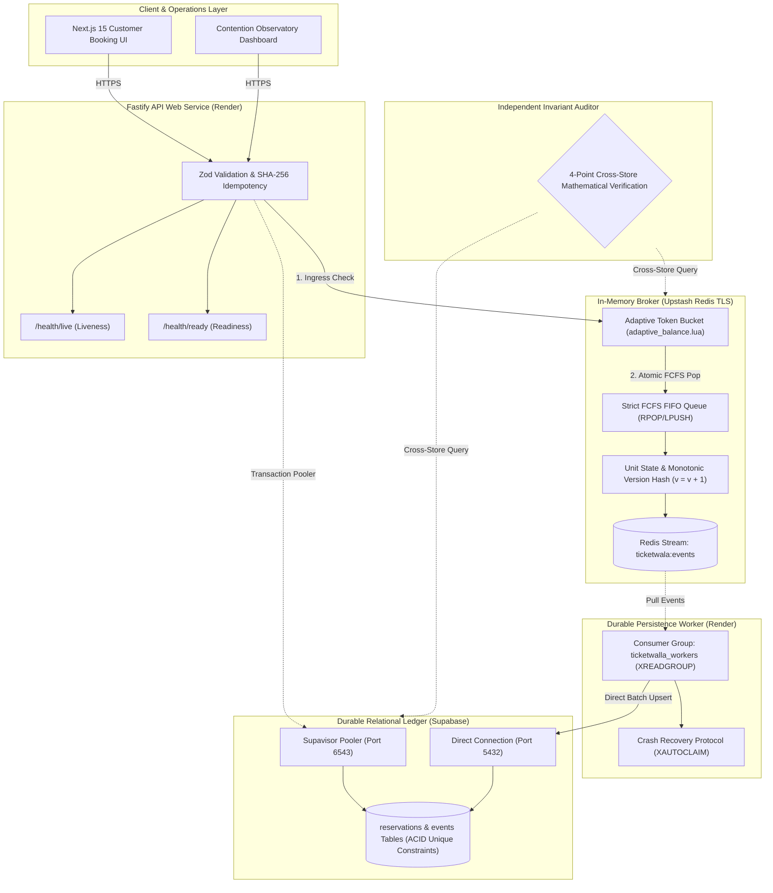

# TicketWala 🎟️
### High-Contention Flash-Reservation & Adaptive Seat Inventory Locking Engine

[](https://nodejs.org/)
[](https://fastify.dev/)
[-red.svg)](https://upstash.com/)
[](https://supabase.com/)
[](https://k6.io/)
[](LICENSE)

---

## 📌 Problem Statement & Architecture Vision

High-velocity digital ticket releases (stadium concerts like Coldplay, Diljit Dosanjh, Taylor Swift, sports playoffs, transit drops) drive thousands of concurrent users to target identical limited inventory slots simultaneously. Under this extreme contention, traditional architectures collapse:
1. **Database Deadlocks & Pool Starvation:** Relational row-level pessimistic locking (`SELECT ... FOR UPDATE`) serializes requests at the database engine, causing 5-second lock waits, connection exhaustion (`sorry, too many clients already`), and cascading server failure.
2. **Race Hazards & Double-Bookings:** Naive read-then-write caching patterns allow competing threads to see the same seat as available before updating, resulting in multiple customers paying for the same ticket.
3. **Delayed Lock Leaks:** Distributed locks without monotonic fencing permit delayed expiration jobs to inadvertently revoke a seat that has already been reassigned to a newer buyer.

### The TicketWala Solution
**TicketWala** decouples write traffic from database persistence by employing an in-memory transactional inventory broker (Redis Lua scripts with an **Adaptive Token Bucket**), enforces temporary reservation holds via 120s server-side time-to-live (TTL) counters, guarantees **strict First-Come-First-Served (FCFS) sub-second holding locks**, provides instant inventory release upon checkout abandonment or timeout, and asynchronously writes finalized transactions to **Supabase PostgreSQL** storage.

> **Fundamental Invariant:** *Supabase PostgreSQL is the final authority for inventory correctness. Redis coordinates work and absorbs contention, but relational unique constraints ensure zero double-bookings permanently.*

---

## 🏛️ System Architecture Topology



---

## 🔒 The 5 Non-Negotiable System Invariants

1. **Absolute Capacity & Zero Double-Booking Bound:**  
   $$\sum \text{Held} + \sum \text{Confirmed} + \sum \text{Available} = N$$  
   No inventory unit can ever have $>1$ active holder or confirmed owner simultaneously.
2. **Strict First-Come-First-Served (FCFS) Ordering:**  
   Seats are allocated from a deterministic Redis FIFO List (`ticketwala:event:{id}:available_queue`) using atomic `RPOP`. Request $N$ arriving at the single-threaded Redis broker is allocated seat $N$ in exact microsecond sequence.
3. **In-Memory Adaptive Request Balancing:**  
   An in-memory **Token Bucket algorithm (`adaptive_balance.lua`)** automatically balances ingress throughput against remaining seat scarcity. When seats reach 0, incoming requests receive instant $O(1)$ short-circuit `409 SOLD_OUT` rejections in $<2\text{ms}$.
4. **Instant Abandonment & Monotonic Version Fencing:**  
   Checkout abandonment or TTL timeout immediately returns the seat to the head of the FIFO queue via `LPUSH`. If a delayed expiry job runs after a seat was reassigned to a newer buyer, monotonic version checking ($V_{\text{job}} < V_{\text{current}}$) renders the job a safe no-op.
5. **Guaranteed Eventual Consistency:**  
   In-memory state transitions atomically append an immutable event to Redis Streams. The background worker commits batches to Supabase with idempotent SQL upserts. Relational storage converges with in-memory state within $<500\text{ms}$.

---

## ⚡ Adaptive Request Balancing: How it Works

The 5,000+ requests against 200 seats represents our **reference high-contention validation scenario**, but the TicketWala engine is fully parameterized to support arbitrary seat counts $N$ (e.g., $N=50$, $N=200$, $N=1,000$, $N=10,000$):

$$\text{AdmissionRate}(t) = f(S_{\text{available}}(t), S_{\text{capacity}})$$

* **Abundant Inventory ($S_{\text{available}} > 50\%$):** Ingress token bucket expands to admit high-volume parallel holding locks.
* **Scattered Inventory ($S_{\text{available}} < 10\%$):** The governor applies progressive backpressure, serializing admissions into strict FIFO processing to eliminate contention thrashing.
* **Sold Out ($S_{\text{available}} = 0$):** Zero-overhead short-circuiting. Subsequent requests are rejected at the memory boundary with clean `409 SOLD_OUT` errors in $<2\text{ms}$, completely shielding the database connection pool.

---

## ☁️ Deployment Architecture: Render + Upstash + Supabase

### 1. Supabase Dual-Connection Topology
* **Transaction Pooler (Port 6543 via Supavisor):** Configured for `apps/api`. Under burst contention, queries flow through Supavisor, preventing PostgreSQL connection exhaustion.
* **Direct Connection (Port 5432):** Configured for `apps/worker` and migration scripts (`db/migrations/`) for session-level batch commits and DDL transactions.

### 2. Two-Tier Health Probes
* `GET /health/live` &mdash; Fast process liveness probe for container lifecycle management.
* `GET /health/ready` &mdash; Non-blocking dependency readiness probe pinging Upstash Redis and Supabase with strict 1,500ms timeouts.

### 3. Graceful Shutdown (`SIGTERM`)
When Render scales down or updates a container, the process ceases accepting new requests, flushes in-flight worker batches to Supabase, issues `XACK` confirmations, and drains connection pools cleanly within 10 seconds.

### 4. Venue-Proof Local Fallback (Hackathon Wi-Fi Insurance)
To guard against venue Wi-Fi failure or cloud cold starts during judging:
* TicketWala includes a 1-command offline setup via `infra/compose.yaml` (or local PostgreSQL 18 + local Redis).
* The entire system, k6 benchmark, and Contention Observatory can run 100% offline on `http://localhost:3000`.

---

## 📡 REST API Specifications

| Method & Path | Headers Required | Payload / Parameters | Success Response | Standard Errors |
|---|---|---|---|---|
| `POST /api/v1/reservations/hold` | `Idempotency-Key`<br>`X-Client-Id` | `{ "eventId": "evt-01" }` | `201 Created`<br>`{ "reservationId": "uuid", "unitId": "unit-012", "holdToken": "secret", "expiresAt": 1791535000 }` | `409 SOLD_OUT`<br>`422 IDEMPOTENCY_CONFLICT`<br>`429 RATE_LIMITED` |
| `POST /api/v1/reservations/:id/confirm` | `Idempotency-Key` | `{ "holdToken": "secret" }` | `200 OK`<br>`{ "status": "CONFIRMED", "unitId": "unit-012" }` | `400 INVALID_HOLD_TOKEN`<br>`409 HOLD_EXPIRED`<br>`409 ALREADY_CONFIRMED` |
| `POST /api/v1/reservations/:id/release` | None | `{ "holdToken": "secret" }` | `200 OK`<br>`{ "status": "RELEASED", "unitId": "unit-012" }` | `400 INVALID_HOLD_TOKEN` |
| `GET /api/v1/reservations/:id` | None | URL Path ID | `200 OK` (State, Timestamps; *Token Redacted*) | `404 NOT_FOUND` |
| `GET /api/v1/ops/inventory` | None | None | `200 OK` (Full seat status array & versions) | `500 INTERNAL_ERROR` |
| `GET /api/v1/ops/metrics` | None | None | `200 OK` (RPS, latency percentiles, queue lag) | `500 INTERNAL_ERROR` |
| `POST /api/v1/ops/audit` | None | None | `200 OK` (4-point invariant verification report) | `500 AUDIT_FAILED` |
| `GET /health/live` | None | None | `200 OK` (`{ "status": "UP" }`) | - |
| `GET /health/ready` | None | None | `200 OK` (`{ "status": "READY", "redis": true, "postgres": true }`) | `503 SERVICE_UNAVAILABLE` |

---

## 🚀 Quickstart & Setup Guide

### Prerequisites
* **Node.js:** v20.x or higher (`node -v`)
* **Package Manager:** npm or pnpm
* **Datastores:** Upstash Redis (or local Redis) + Supabase Postgres (or local Postgres)
* **Load Runner:** [k6 CLI](https://k6.io/) installed

### 1. Clone & Configure
```bash
git clone https://github.com/WolverineAryan/TicketWala.git
cd TicketWala

# Copy environment template
cp .env.example .env
```

### 2. Database Migrations
Apply versioned migrations to Supabase PostgreSQL:
```bash
npm run db:migrate
```

### 3. Start Local Development
```bash
# Terminal 1: Fastify API Gateway
npm run dev:api

# Terminal 2: Persistence Worker
npm run dev:worker

# Terminal 3: Next.js Frontend & Contention Observatory
npm run dev:web
```

---

## 📊 High-Concurrency Load Benchmark (k6)

Run the headless 5,000+ request contention suite against the running instance:
```bash
# 1. Smoke test (sanity check)
k6 run tests/load/smoke.js

# 2. 5,000-Request Contention Burst
k6 run -e BASE_URL=http://localhost:8000 tests/load/burst-contention.js
```

### Expected Benchmark Results
* **Total Offered Requests:** 5,000+ within a 15-second burst window.
* **Confirmed Holds:** Exactly equal to available seats (e.g. 200).
* **Clean Rejections:** Exactly 4,800 returned with instantaneous `409 SOLD_OUT`.
* **Latency Profile:** p50 < 10ms, p95 < 45ms, p99 < 85ms.
* **Double Allocations:** Exactly **0** (verified via `POST /api/v1/ops/audit`).

---

## 🎬 7-Minute Judge Presentation Script

* **0:00 - 1:00 (Context):** The flash reservation dilemma: RDBMS connection pool exhaustion vs. naive distributed lock overselling.
* **1:00 - 2:30 (Architecture):** Decoupled architecture: In-memory atomic Lua broker + Adaptive Token Bucket + strict FCFS FIFO queue + Supabase durable ledger.
* **2:30 - 4:00 (Live Contention):** Open **Contention Observatory** &rarr; trigger 5,000 concurrent requests &rarr; watch seats lock in microsecond sequence while excess traffic receives instant 409 rejections.
* **4:00 - 5:30 (Chaos Resilience):** Kill the persistence worker process live &rarr; show stream backlog accumulating safely &rarr; reboot worker &rarr; show zero data loss with `XAUTOCLAIM`.
* **5:30 - 6:30 (Mathematical Proof):** Click **Run Invariant Auditor** live &rarr; show 100% green checkmarks for all invariants.
* **6:30 - 7:00 (Conclusion):** Q&A.

---

## 📋 Demo Handoff Sheet

| Item | Production Value |
|---|---|
| **Platform Name** | **TicketWala** |
| **Production UI URL** | `https://ticketwala.onrender.com` |
| **Production API / Health** | `https://api-ticketwala.onrender.com/health/ready` |
| **Durable Database** | Supabase Postgres (AWS Region, Pooler Port 6543 / Direct Port 5432) |
| **Memory & Streams** | Upstash Redis (TLS enabled, Redis Streams group `ticketwalla_workers`) |
| **Git Commit / Release** | `v1.0.0-release (main)` |
| **Database Migration Version** | `001_init_ticketwala_schema.sql` |
| **Local Fallback Command** | `docker compose -f infra/compose.yaml up --build` |
| **k6 Test Profile** | 5,000 requests, 150 VUs, 15s duration, strict FCFS assertion |
| **Benchmark Evidence Files** | `tests/load/results/benchmark_5000_req.json` |

---

## 📄 License
This project is licensed under the MIT License - see the [LICENSE](LICENSE) file for details.
