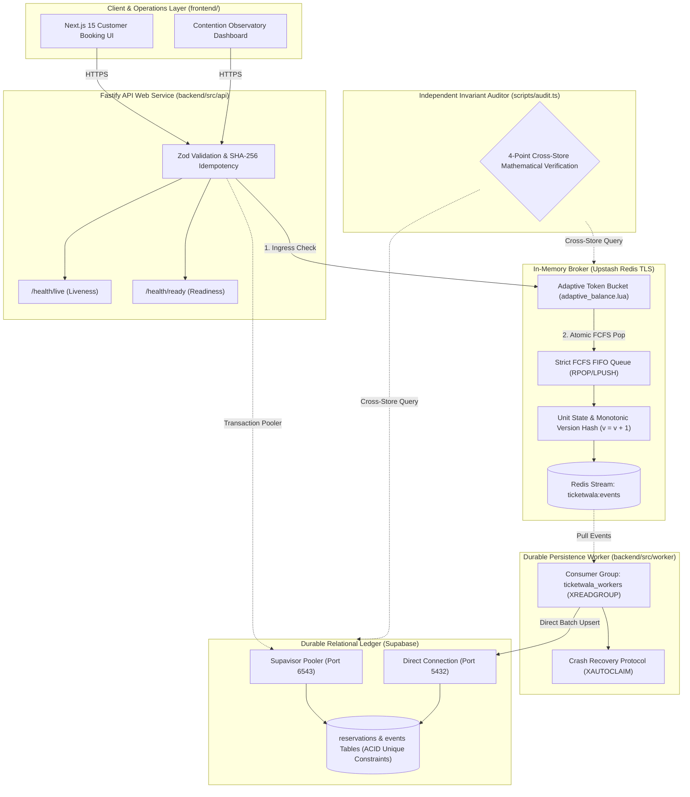

# TicketWala 🎟️
### High-Contention Flash-Reservation & Adaptive Seat Inventory Locking Engine

[](https://nodejs.org/)
[](https://nextjs.org/)
[](https://fastify.dev/)
[-red.svg)](https://upstash.com/)
[](https://supabase.com/)
[](https://k6.io/)
[](LICENSE)

---

## 📌 Problem Statement & Architecture Vision

High-velocity digital ticket releases (stadium concerts, sports playoffs, transit flash allocations) drive thousands of concurrent users to target identical limited inventory slots simultaneously. Under this extreme contention, traditional architectures collapse:
1. **Database Deadlocks & Pool Starvation:** Relational row-level pessimistic locking (`SELECT ... FOR UPDATE`) serializes requests at the database engine, causing 5-second lock waits, connection exhaustion (`sorry, too many clients already`), and cascading server failure.
2. **Race Hazards & Double-Bookings:** Naive read-then-write caching patterns allow competing threads to see the same seat as available before updating, resulting in multiple customers paying for the same ticket.
3. **Delayed Lock Leaks:** Distributed locks without monotonic fencing permit delayed expiration jobs to inadvertently revoke a seat that has already been reassigned to a newer buyer.

### The TicketWala Solution
**TicketWala** decouples write traffic from database persistence by employing an in-memory transactional inventory broker (Redis Lua scripts with an **Adaptive Token Bucket**), enforces temporary reservation holds via 120s server-side time-to-live (TTL) counters, guarantees **strict First-Come-First-Served (FCFS) sub-second holding locks**, provides instant inventory release upon checkout abandonment or timeout, and asynchronously writes finalized transactions to **Supabase PostgreSQL** storage.

> **Fundamental Invariant:** *Supabase PostgreSQL is the final authority for inventory correctness. Redis coordinates work and absorbs contention, but relational unique constraints ensure zero double-bookings permanently.*

---

## 🗂️ Clean Repository Structure: Frontend & Backend

The repository is divided into two distinct, decoupled environments:

```
TicketWala/
├── frontend/                  # Next.js 15 Client & Scaffold
│   ├── src/
│   │   ├── app/               # App Router pages (layout.tsx, page.tsx)
│   │   └── types/api.ts       # Fully typed API DTOs & Contracts
│   ├── Dockerfile             # Standalone Frontend Container
│   ├── package.json           # Frontend dependencies (React 19, Next 15)
│   └── README.md              # Frontend Developer Guide
│
├── backend/                   # High-Concurrency Core Engine
│   ├── src/
│   │   ├── api/server.ts      # Fastify REST Gateway
│   │   ├── worker/worker.ts   # Redis Streams -> Supabase Sync Worker
│   │   ├── lua/               # Atomic Lua Scripts (Adaptive Bucket, FCFS)
│   │   └── contracts/         # Zod schemas & shared DTOs
│   ├── db/migrations/         # Supabase PostgreSQL DDL & Invariants
│   ├── scripts/               # migrate.ts, seed.ts, audit.ts
│   ├── tests/
│   │   ├── concurrency/       # 50:1 race hazard test suite
│   │   └── load/              # k6 5,000+ request burst scripts
│   ├── Dockerfile.api         # Fastify API Container
│   ├── Dockerfile.worker      # Persistence Worker Container
│   ├── package.json           # Backend dependencies (Fastify, ioredis, pg)
│   └── README.md              # Backend Developer Guide
│
├── infra/
│   └── compose.yaml           # Docker Compose full-stack orchestration
├── docs/                      # PRD, SRS, Implementation Plan PDFs (local)
├── .env.example               # Unified environment variables
└── README.md                  # Project Root Documentation
```

---

## 🏛️ System Architecture Topology



---

## 🔒 The 5 Non-Negotiable System Invariants

1. **Absolute Capacity & Zero Double-Booking Bound:**  
   $$\sum \text{Held} + \sum \text{Confirmed} + \sum \text{Available} = N$$  
   No inventory unit can ever have $>1$ active holder or confirmed owner simultaneously.
2. **Strict First-Come-First-Served (FCFS) Ordering:**  
   Seats are allocated from a deterministic Redis FIFO List (`ticketwala:event:{id}:available_queue`) using atomic `RPOP`. Request $N$ arriving at the single-threaded Redis broker is allocated seat $N$ in exact microsecond sequence.
3. **In-Memory Adaptive Request Balancing:**  
   An in-memory **Token Bucket algorithm (`adaptive_balance.lua`)** automatically balances ingress throughput against remaining seat scarcity. When seats reach 0, incoming requests receive instant $O(1)$ short-circuit `409 SOLD_OUT` rejections in $<2\text{ms}$.
4. **Instant Abandonment & Monotonic Version Fencing:**  
   Checkout abandonment or TTL timeout immediately returns the seat to the head of the FIFO queue via `LPUSH`. If a delayed expiry job runs after a seat was reassigned to a newer buyer, monotonic version checking ($V_{\text{job}} < V_{\text{current}}$) renders the job a safe no-op.
5. **Guaranteed Eventual Consistency:**  
   In-memory state transitions atomically append an immutable event to Redis Streams. The background worker commits batches to Supabase with idempotent SQL upserts. Relational storage converges with in-memory state within $<500\text{ms}$.

---

## ⚡ Adaptive Request Balancing: Dynamic Capacity Scaling

The 5,000+ requests against 200 seats represents our **reference high-contention validation scenario**, but TicketWala is fully parameterized to support arbitrary seat counts $N$ (e.g., $N=50$, $N=200$, $N=1,000$, $N=10,000$):

$$\text{AdmissionRate}(t) = f(S_{\text{available}}(t), S_{\text{capacity}})$$

* **Abundant Inventory ($S_{\text{available}} > 50\%$):** Ingress token bucket expands to admit high-volume parallel holding locks.
* **Scattered Inventory ($S_{\text{available}} < 10\%$):** The governor applies progressive backpressure, serializing admissions into strict FIFO processing to eliminate contention thrashing.
* **Sold Out ($S_{\text{available}} = 0$):** Zero-overhead short-circuiting. Subsequent requests are rejected at the memory boundary with clean `409 SOLD_OUT` errors in $<2\text{ms}$, completely shielding the database connection pool.

---

## ☁️ Deployment Architecture: Render + Upstash + Supabase

### 1. Supabase Dual-Connection Topology
* **Transaction Pooler (Port 6543 via Supavisor):** Configured for `DATABASE_URL`. Under burst contention, queries flow through Supavisor, preventing PostgreSQL connection exhaustion.
* **Direct Connection (Port 5432):** Configured for `DATABASE_DIRECT_URL` (`worker` and `scripts/migrate.ts`) for session-level batch commits and DDL transactions.

### 2. Two-Tier Health Probes
* `GET /health/live` &mdash; Fast process liveness probe for container lifecycle management.
* `GET /health/ready` &mdash; Non-blocking dependency readiness probe pinging Upstash Redis and Supabase with strict 1,500ms timeouts.

### 3. Graceful Shutdown (`SIGTERM`)
When Render scales down or updates a container, the process ceases accepting new requests, flushes in-flight worker batches to Supabase, issues `XACK` confirmations, and drains connection pools cleanly within 10 seconds.

### 4. Venue-Proof Local Fallback
TicketWala includes a 1-command offline setup via `infra/compose.yaml`. The entire system, k6 benchmark, and Contention Observatory can run 100% offline.

---

## 📡 REST API Specifications

| Method & Path | Headers Required | Payload / Parameters | Success Response | Standard Errors |
|---|---|---|---|---|
| `POST /api/v1/reservations/hold` | `Idempotency-Key` | `{ "eventId": "evt-main" }` | `201 Created`<br>`{ "reservationId": "uuid", "unitId": "unit-012", "holdToken": "secret", "expiresAt": 1791535000 }` | `409 SOLD_OUT`<br>`422 IDEMPOTENCY_CONFLICT`<br>`429 RATE_LIMITED` |
| `POST /api/v1/reservations/:id/confirm` | `Idempotency-Key` | `{ "holdToken": "secret" }` | `200 OK`<br>`{ "status": "CONFIRMED", "unitId": "unit-012" }` | `400 INVALID_HOLD_TOKEN`<br>`409 HOLD_EXPIRED`<br>`409 ALREADY_CONFIRMED` |
| `POST /api/v1/reservations/:id/release` | None | `{ "holdToken": "secret" }` | `200 OK`<br>`{ "status": "RELEASED", "unitId": "unit-012" }` | `400 INVALID_HOLD_TOKEN` |
| `GET /api/v1/ops/inventory` | None | None | `200 OK` (Full seat status array & versions) | `500 INTERNAL_ERROR` |
| `GET /api/v1/ops/metrics` | None | None | `200 OK` (Queue size, holds, confirms, sold out count) | `500 INTERNAL_ERROR` |
| `POST /api/v1/ops/audit` | None | None | `200 OK` (4-point invariant verification report) | `500 AUDIT_FAILED` |
| `GET /health/live` | None | None | `200 OK` (`{ "status": "alive" }`) | - |
| `GET /health/ready` | None | None | `200 OK` (`{ "status": "ready", "redis": "healthy", "postgres": "healthy" }`) | `503 SERVICE_UNAVAILABLE` |

---

## 🚀 Quickstart & Setup Guide

### 1. Configure Environment
```bash
# Copy environment template
cp .env.example .env
```

### 2. Frontend Development (UI Developer)
```bash
cd frontend
npm install
npm run dev
# Open http://localhost:3000
```

### 3. Backend Development (Backend / Systems Engineer)
```bash
cd backend
npm install

# Run database migrations against Supabase
npm run db:migrate

# Seed event inventory (e.g., 200 units)
npm run db:seed 200

# Start API Gateway (Port 8000)
npm run dev:api

# Start Stream Persistence Worker
npm run dev:worker
```

### 4. Running from Workspace Root
```bash
npm run dev:frontend   # Launches Next.js UI
npm run dev:backend    # Launches Fastify API
npm run dev:worker     # Launches Sync Worker
npm run test           # Executes Concurrency test suite
npm run ops:audit      # Runs Invariant Mathematical Auditor
```

---

## 📊 High-Concurrency Load Benchmark (k6)

Run the headless 5,000+ request contention suite:
```bash
# In backend/ directory:
npm run bench:smoke
npm run bench:burst
```

### Benchmark Invariant Assertions
* **Offered Traffic:** 5,000+ requests across 15 seconds.
* **Confirmed Holds:** Exactly equal to available seats (e.g. 200).
* **Clean Rejections:** Exactly 4,800 returned with instantaneous `409 SOLD_OUT`.
* **Double Allocations:** Exactly **0** (verified via `npm run ops:audit`).

---

## 📋 Demo Handoff Sheet

| Item | Production Value |
|---|---|
| **Platform Name** | **TicketWala** |
| **Frontend Directory** | `frontend/` (Next.js 15, React 19) |
| **Backend Directory** | `backend/` (Fastify, Redis Lua, Supabase Worker) |
| **Durable Database** | Supabase Postgres (Pooler Port 6543 / Direct Port 5432) |
| **Memory Broker** | Upstash Redis (TLS enabled, Stream Group `ticketwala_workers`) |
| **Database Migration** | `backend/db/migrations/001_init_ticketwala_schema.sql` |
| **Local Fallback** | `docker compose -f infra/compose.yaml up --build` |
| **Invariant Auditor** | `npm run ops:audit` |

---

## 📄 License
This project is licensed under the MIT License - see the [LICENSE](LICENSE) file for details.
