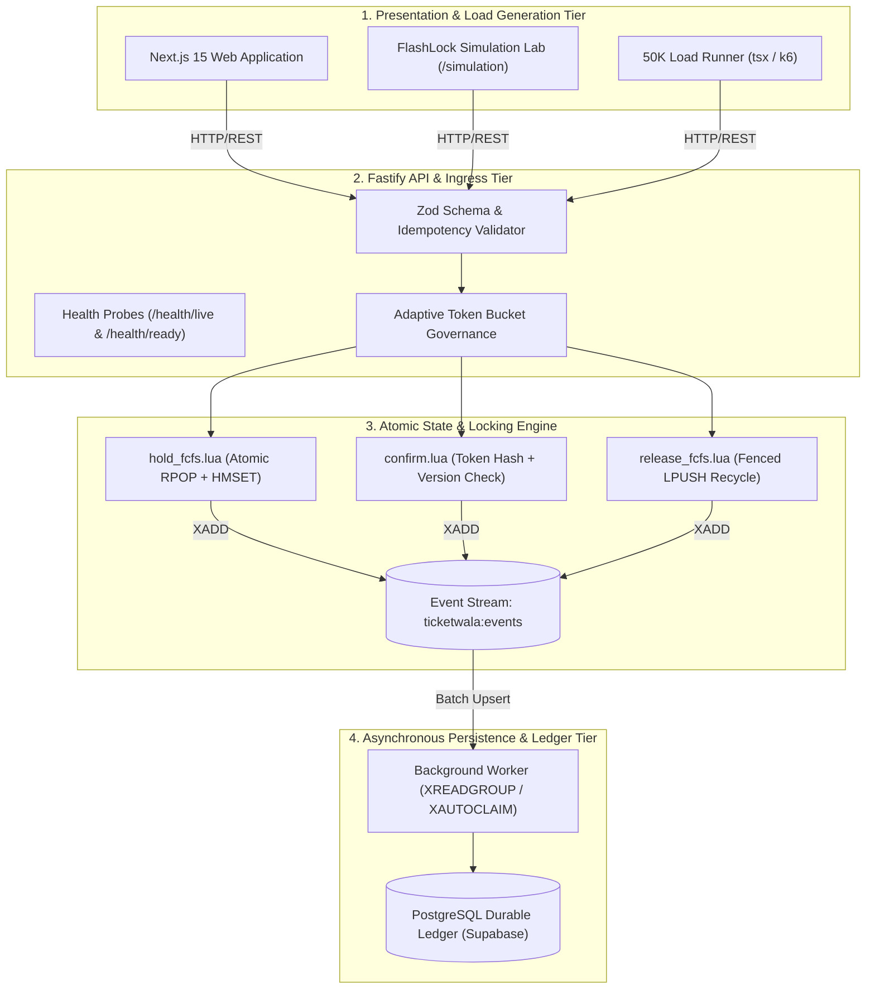

# TicketWala — Software Requirements Specification (SRS)
## System Architecture & Atomic State Machine Specification

> **Official PDF Version:** [Download TicketWala_SRS.pdf](./TicketWala_SRS.pdf)  
> **Companion Documents:** [Product Requirements Document (PRD)](./PRD.md) • [50K Load Testing Report](./LOAD_TESTING_50K_REPORT.md)  
> **Version:** 2.0.0 • **Architecture:** Distributed Atomic Locking & Event-Driven Persistence  

---

## 1. System Architecture Overview

TicketWala separates high-speed **Ingress & Lock Contention** from **Durable Relational Persistence** using a multi-tier architecture:



---

## 2. Atomic Lua State Machine Specifications

### 2.1 Adaptive Ingress Governance (`ADAPTIVE_BALANCE_LUA`)
 dynamically scales admission capacity proportional to remaining inventory $N_{\text{avail}}$:
- **Short-Circuit Rule:** If `LLEN(available_queue) == 0`, immediately return `{"admitted": 0, "reason": "SOLD_OUT", "code": 409}` in $O(1)$ time without allocating locks.
- **Dynamic Token Bucket:**
  $$C_{\text{dynamic}} = \min\left(C_{\text{base}}, \max(10, 2 \cdot N_{\text{avail}})\right)$$
  $$R_{\text{dynamic}} = \min\left(R_{\text{base}}, \max(5, N_{\text{avail}})\right)$$

### 2.2 Strict FCFS Hold Acquisition (`HOLD_FCFS_LUA`)
Executes atomically within a single execution frame:
1. **Idempotency Lookup:** Checks `GET ticketwala:idempotency:{key}`. If present, verifies MD5 payload fingerprint. Returns `422 IDEMPOTENCY_CONFLICT` on parameter tampering, or replays the cached response.
2. **Inventory Claim:**
   - For general FCFS: `RPOP ticketwala:event:{id}:available_queue` ($O(1)$).
   - For specific seat selection: Verifies `HGET unit_key status == 'AVAILABLE'` and removes from queue via `LREM`.
3. **Versioned State Binding:**
   - Sets unit state to `HELD`, increments monotonic `version`, binds `reservation_id`, stores SHA-256 `token_hash`, and sets `expires_at = now + ttl`.
   - Appends transition event to `ticketwala:events` stream via `XADD`.

### 2.3 Version-Fenced Release & Expiry (`RELEASE_FCFS_LUA`)
Prevents the classic **Stale Expiry Race Hazard**:
- Suppose User A holds `unit-001` (version 1), releases it early, and User B immediately claims `unit-001` (version 2).
- When User A's delayed timeout timer fires, the script compares the job's `reservation_id` against the unit's current `reservation_id`.
- Because `unit.reservation_id != User_A.reservation_id`, the script returns `IGNORED_STALE_RELEASE`, leaving User B's hold 100% intact.

---

## 3. Relational Database Schema (PostgreSQL)

```sql
CREATE TABLE events (
    id VARCHAR(64) PRIMARY KEY,
    title VARCHAR(255) NOT NULL,
    category VARCHAR(32) NOT NULL,
    venue VARCHAR(255) NOT NULL,
    total_seats INTEGER NOT NULL CHECK (total_seats > 0),
    available_seats INTEGER NOT NULL CHECK (available_seats >= 0),
    base_price NUMERIC(10, 2) NOT NULL,
    created_at TIMESTAMPTZ DEFAULT NOW()
);

CREATE TABLE reservations (
    reservation_id UUID PRIMARY KEY,
    event_id VARCHAR(64) NOT NULL REFERENCES events(id),
    unit_id VARCHAR(32) NOT NULL,
    status VARCHAR(20) NOT NULL CHECK (status IN ('HELD', 'CONFIRMED', 'RELEASED', 'EXPIRED')),
    hold_token_hash VARCHAR(64) NOT NULL,
    version INTEGER NOT NULL DEFAULT 1,
    pnr VARCHAR(32) UNIQUE,
    passenger_name VARCHAR(128),
    amount_paid NUMERIC(10, 2),
    expires_at BIGINT NOT NULL,
    confirmed_at BIGINT,
    updated_at TIMESTAMPTZ DEFAULT NOW()
);

CREATE INDEX idx_reservations_event_unit ON reservations(event_id, unit_id);
```

---

## 4. API Endpoint Contracts

| Method | Endpoint | Description | Success | Error Codes |
|:---:|:---|:---|:---:|:---|
| `GET` | `/health/live` | Process liveness check | `200 OK` | &mdash; |
| `GET` | `/health/ready` | Redis & PostgreSQL readiness probe | `200 OK` | `503 Service Unavailable` |
| `GET` | `/api/v1/events` | List catalog events with live seat counts | `200 OK` | &mdash; |
| `GET` | `/api/v1/events/:id/seats` | Retrieve full seat matrix & tier pricing | `200 OK` | `404 Not Found` |
| `POST` | `/api/v1/reservations/hold` | Acquire atomic 60s seat lock | `201 Created` | `409 Sold Out`, `422 Conflict`, `429 Rate Limit` |
| `POST` | `/api/v1/reservations/:id/confirm` | Confirm hold & issue PNR + QR pass | `200 OK` | `403 Invalid Token`, `409 Expired` |
| `POST` | `/api/v1/reservations/:id/release` | Voluntarily release held seat back to pool | `200 OK` | `404 Not Found` |
| `POST` | `/api/v1/tickets/verify-scan` | Gate QR/PNR verification & anti-replay | `200 OK` | `409 Already Scanned`, `404 Invalid` |
| `POST` | `/api/v1/simulation/run-scenario` | Execute FlashLock contention scenarios (1–6) | `200 OK` | `400 Invalid Scenario` |

---

## 5. High-Concurrency Verification Summary (50,000 Users / 5,000 Seats)

| Metric | Verified Result | Architectural Mechanism |
|:---|:---:|:---|
| **Simulated Contenders** | `50,000` | Concurrent worker batches (`CONCURRENCY=500`) |
| **Available Seats** | `5,000` | Event `evt-mega-stadium-5000` (`unit-0001` to `unit-5000`) |
| **Successful Holds (`201`)** | `5,000` | Atomic FIFO queue pop |
| **Sold-Out Rejections (`409`)** | `45,000` | $O(1)$ empty-queue short-circuit |
| **Double-Bookings** | `0` | Single-threaded atomic execution & version fencing |
| **Throughput** | `10,829.3 RPS` | Zero-blocking in-memory / Lua state transitions |
| **Latency ($p_{50}$ / $p_{95}$ / $p_{99}$)** | `27.82ms` / `59.64ms` / `68.81ms` | Sub-100ms tail latency under 10x oversubscription |
